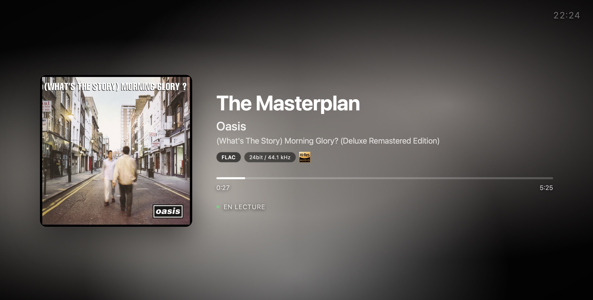

<p align="center">
  
</p>

# nowplaying

<p align="center">
  <a href="https://cdn.jsdelivr.net/gh/mat-d3v/nowplaying@main/assets/nowplaying-presentation.mp4">
    
  </a>
  <br>
  <sub>▶ <a href="https://cdn.jsdelivr.net/gh/mat-d3v/nowplaying@main/assets/nowplaying-presentation.mp4">Voir la vidéo de présentation</a> (52 s, avec le son, en anglais)</sub>
</p>



Page plein écran "En lecture" pour MPD. Affiche le titre en cours avec un dégradé de fond extrait de la pochette, des badges de qualité audio et la détection Hi-Res.

Ni nginx ni paquet Python à installer - le pont n'utilise que la bibliothèque standard et sert tout sur le port 8766.

## Ce que ça affiche

- Dégradé de fond extrait des couleurs de la pochette
- Pochettes directement via mpd (tags embarqués ou cover du dossier), Last.fm en secours optionnel quand mpd n'en a pas (il faut les tags artiste et album)
- Badge du codec (FLAC, ALAC, MP3, AAC...) avec profondeur de bits et fréquence d'échantillonnage
- Logo Hi-Res Audio pour les fichiers sans perte >= 88,2 kHz ou >= 24 bits, et pour le DSD
- Les fichiers sans tags et les radios affichent le nom du fichier ou de la station
- Barre de progression avec temps écoulé et total
- Défilement automatique pour les titres longs
- Assombrissement en pause
- Horloge en haut à droite
- Ligne « À suivre » avec le prochain morceau de la file
- Progression interpolée entre les polls (plus de sauts de 2 s)
- Indicateur « hors ligne » si le pont ne répond plus
- Mise en page portrait adaptée aux téléphones (iOS et Android) : pochette centrée en haut, horloge masquée
- Wake Lock (écran maintenu allumé) et plein écran via l'écran d'accueil, sur iOS comme sur Android (le Wake Lock exige HTTPS ou localhost, voir plus bas)

## Prérequis

- MPD
- Python 3, rien d'autre à installer
- Optionnel : une clé API Last.fm pour les pochettes des streams et radios - gratuite sur https://www.last.fm/api

## Démarrage

```bash
git clone https://github.com/mat-d3v/nowplaying.git
cd nowplaying
cp .env.example .env   # optionnel : réglages, par exemple votre clé Last.fm
python3 mpd-bridge.py
```

Ouvrez ensuite http://localhost:8766 dans un navigateur, ou `http://<ip-de-la-machine>:8766` depuis un téléphone ou une tablette.

Version française : http://localhost:8766/index.fr.html ou http://localhost:8766/?lang=fr

## Configuration

Les réglages viennent des variables d'environnement ou d'un fichier `.env` placé à côté de `mpd-bridge.py` (copie de `.env.example`). Les variables d'environnement sont prioritaires sur `.env`.

| Variable | Défaut | Description |
|----------|--------|-------------|
| LASTFM_API_KEY | vide (désactivé) | Secours pochettes quand mpd n'en a pas (streams, radios) |
| MPD_HOST | 127.0.0.1 | Hôte MPD |
| MPD_PORT | 6600 | Port MPD |
| PORT | 8766 | Port HTTP du pont |
| ALSA_CARD | 0 | Carte ALSA lue pour le format audio quand mpd ne le donne pas |

## Lancer comme service (systemd)

```bash
./install.sh
```

Crée `.env` (demande une clé Last.fm optionnelle) et installe un service `mpd-bridge` qui tourne sous votre utilisateur et démarre au boot. Relancez-le après un `git pull` pour redémarrer le service sur la nouvelle version.

## Docker

```bash
docker compose up -d
```

Le conteneur utilise le réseau de l'hôte : le pont joint mpd sur `127.0.0.1` et écoute sur le port 8766 de l'hôte. Les réglages viennent de `.env`, comme pour une installation locale. Le réseau hôte fonctionne directement sous Linux ; Docker Desktop (macOS, Windows) demande de l'activer dans ses réglages.

## Garder l'écran allumé

Les navigateurs n'accordent le Wake Lock qu'aux pages sécurisées : HTTPS, ou `localhost`. Un téléphone ou une tablette qui ouvre `http://192.168.x.x:8766` affiche la page, mais sans Wake Lock : désactivez la mise en veille automatique de l'appareil, ou placez le pont derrière un reverse proxy HTTPS (`nginx.conf` sert de point de départ).

## Licence

[MIT](LICENSE)
