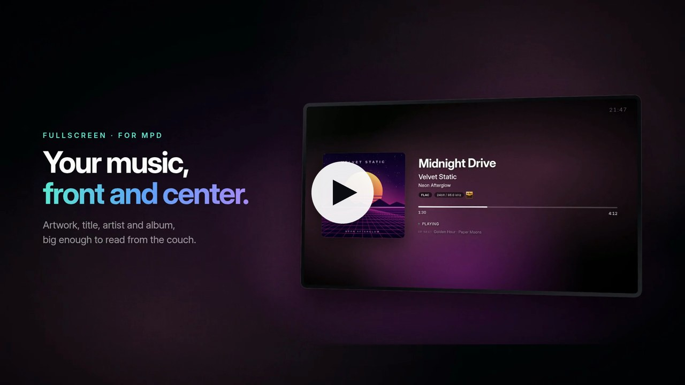
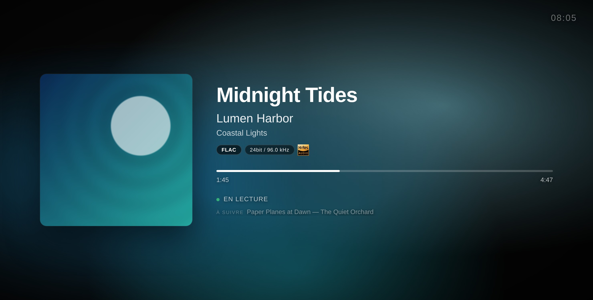

<p align="center">
  
</p>

# nowplaying

<p align="center">
  <a href="https://github.com/mat-d3v/nowplaying/actions/workflows/ci.yml"></a>
  <a href="https://github.com/mat-d3v/nowplaying/releases/latest"></a>
</p>

<p align="center">
  <a href="https://cdn.jsdelivr.net/gh/mat-d3v/nowplaying@main/assets/nowplaying-presentation.mp4">
    
  </a>
  <br>
  <sub>▶ <a href="https://cdn.jsdelivr.net/gh/mat-d3v/nowplaying@main/assets/nowplaying-presentation.mp4">Voir la vidéo de présentation</a> (52 s, avec le son, en anglais)</sub>
</p>



Page plein écran "En lecture" pour MPD. Affiche le titre en cours avec un dégradé de fond extrait de la pochette, des badges de qualité audio et la détection Hi-Res.

Ni nginx ni paquet Python à installer - le pont n'utilise que la bibliothèque standard et sert tout sur le port 8766.

## Ce que ça affiche

- Dégradé de fond extrait des couleurs de la pochette (ou la pochette floutée, voir les [options d'affichage](#options-daffichage))
- Pochettes directement via mpd (tags embarqués ou cover du dossier). Quand mpd n'en a pas, et pour les radios, via l'API iTunes Search (gratuite, sans clé), ou Last.fm avec une clé API. Le titre s'affiche tout de suite, la pochette suit
- Badge du codec (FLAC, ALAC, MP3, AAC...) avec profondeur de bits et fréquence d'échantillonnage, y compris pour les morceaux lus depuis un serveur UPnP/DLNA (upmpdcli, BubbleUPnP, MinimServer...)
- Logo Hi-Res Audio pour les fichiers sans perte >= 88,2 kHz ou >= 24 bits, et pour le DSD
- Radios : badge « En direct », « Artiste - Titre » séparé sur deux lignes, nom de la station en dessous
- Les fichiers sans tags affichent leur nom de fichier
- AirPlay : ce qui est joué depuis un iPhone, un iPad ou un Mac via shairport-sync s'affiche aussi
- Mises à jour instantanées : le pont pousse chaque changement dès qu'il a lieu (morceau, pause, avance, file d'attente)
- Barre de progression avec temps écoulé et total, interpolée en douceur
- Défilement automatique pour les titres longs
- Assombrissement en pause
- Horloge en haut à droite
- Ligne « À suivre » avec le prochain morceau de la file
- Messages clairs quand mpd est injoignable ou demande un mot de passe, et indicateur « hors ligne » si le pont ne répond plus
- Anglais et français, selon la langue du navigateur
- S'adapte à tout écran, du 800×480 à la 4K : sur un petit écran, l'affichage se réduit pour laisser sa place au texte ; sur un grand, il s'agrandit
- Écrans verticaux (une TV posée sur le côté, le Raspberry Pi Touch Display 2, les téléphones) : pochette en haut, texte en dessous
- Appli plein écran depuis l'écran d'accueil (sur Android, il faut HTTPS ou localhost), avec Wake Lock pour garder l'écran allumé (HTTPS ou localhost aussi, voir plus bas)

## Prérequis

- MPD
- Python 3.7 ou plus récent, rien d'autre à installer
- Optionnel : une clé API Last.fm - gratuite sur https://www.last.fm/api

## Démarrage

```bash
git clone https://github.com/mat-d3v/nowplaying.git
cd nowplaying
cp .env.example .env   # optionnel : réglages, par exemple le mot de passe mpd
python3 mpd-bridge.py
```

Ouvrez ensuite http://localhost:8766 dans un navigateur, ou `http://<ip-de-la-machine>:8766` depuis un téléphone ou une tablette.

La page suit la langue du navigateur (anglais ou français). Pour en forcer une : http://localhost:8766/?lang=fr ou `?lang=en` (http://localhost:8766/index.fr.html fonctionne toujours).

## Essayer sans mpd

```bash
DEMO=1 python3 mpd-bridge.py
```

Joue en boucle quelques morceaux inventés (FLAC Hi-Res, ALAC, MP3, une radio, DSD), un toutes les 20 secondes (`DEMO_STEP` pour changer ce délai), avec des pochettes générées : pratique pour essayer la page, ou faire des captures comme celle du haut.

## Vérifier l'installation

```bash
python3 mpd-bridge.py --check
```

Teste la connexion à mpd et son mot de passe, le format et la pochette du morceau en cours, les mises à jour instantanées, le HTTPS, le port et les pochettes en ligne, et indique comment corriger ce qui ne va pas. Avec Docker : `docker compose run --rm nowplaying python mpd-bridge.py --check`.

## Options d'affichage

À ajouter à l'URL, combinées avec `&` - par exemple http://localhost:8766/?bg=blur&clock=12

| Option | Effet |
|--------|-------|
| `lang=fr`, `lang=en` | Force la langue |
| `clock=0` | Masque l'horloge |
| `clock=12` | Horloge sur 12 heures |
| `next=0` | Masque la ligne « À suivre » |
| `bg=blur` | Pochette floutée en fond, au lieu du dégradé de couleurs |
| `scale=1.5` | Taille réglée à la main (de `0.5` à `3`), par exemple plus grand pour un écran vu de loin. Par défaut, la page s'adapte à l'écran |
| `shift=0` | Sans protection contre le marquage. Par défaut, l'affichage se décale de quelques pixels toutes les 3 minutes, trop lentement pour s'en apercevoir, pour que les écrans OLED n'en gardent pas la trace |

## Configuration

Les réglages viennent des variables d'environnement ou d'un fichier `.env` placé à côté de `mpd-bridge.py` (copie de `.env.example`). Les variables d'environnement sont prioritaires sur `.env`.

| Variable | Défaut | Description |
|----------|--------|-------------|
| MPD_HOST | 127.0.0.1 | Hôte MPD |
| MPD_PORT | 6600 | Port MPD |
| MPD_PASSWORD | vide | Mot de passe MPD, si `mpd.conf` en définit un |
| PORT | 8766 | Port du pont |
| ITUNES_ARTWORK | 1 (activé) | Pochettes via l'API iTunes Search, pour les radios et les morceaux sans pochette dans mpd. Seuls l'artiste, le titre et l'album sont envoyés ; `0` désactive |
| LASTFM_API_KEY | vide (désactivé) | Secours pochettes Last.fm quand mpd n'en a pas (il faut les tags artiste et album) |
| TLS_CERT, TLS_KEY | vide | Certificat et clé privée (PEM) pour servir en HTTPS, voir plus bas |
| ALSA_CARD | 0 | Carte ALSA lue pour le format audio quand mpd ne le donne pas |
| SHAIRPORT_PIPE | /tmp/shairport-sync-metadata | Tube de métadonnées de shairport-sync, pour AirPlay ; vide, AirPlay est coupé |
| DEMO | vide | `1` pour le mode démo : morceaux inventés, sans mpd |

## Lancer comme service (systemd)

```bash
./install.sh
```

Crée `.env` (demande un mot de passe mpd et une clé Last.fm, tous deux optionnels), installe un service `mpd-bridge` qui tourne sous votre utilisateur et démarre au boot, puis vérifie l'installation. Relancez-le après un `git pull` pour redémarrer le service sur la nouvelle version. Journaux : `journalctl -u mpd-bridge -f`.

## Docker

```bash
docker compose up -d
```

Le conteneur utilise le réseau de l'hôte : le pont joint mpd sur `127.0.0.1` et écoute sur le port 8766 de l'hôte. Les réglages viennent de `.env`, comme pour une installation locale. Le réseau hôte fonctionne directement sous Linux ; Docker Desktop (macOS, Windows) demande de l'activer dans ses réglages. Journaux : `docker compose logs -f`.

## AirPlay (shairport-sync)

Quand [shairport-sync](https://github.com/mikebrady/shairport-sync) tourne sur la même machine, la page affiche aussi ce qui est joué en AirPlay : titre, artiste, album, pochette, progression, et l'appareil qui diffuse. AirPlay passe en premier pendant la lecture ; en pause, si mpd joue, c'est mpd qui s'affiche ; quand AirPlay s'arrête, mpd revient.

Dans `/etc/shairport-sync.conf`, activez les métadonnées (décommentez ces lignes dans sa section `metadata`), puis redémarrez-le avec `sudo systemctl restart shairport-sync` :

```
metadata =
{
	enabled = "yes";
	include_cover_art = "yes";
	pipe_name = "/tmp/shairport-sync-metadata";
	pipe_timeout = 5000;
};
```

Le pont lit ce tube tout seul, et `--check` indique s'il le trouve. `SHAIRPORT_PIPE` change son chemin, ou coupe AirPlay s'il est vide. Un seul programme peut lire le tube. Avec Docker, décommentez sa ligne dans `docker-compose.yml`.

## HTTPS : écran allumé et installation de l'appli

Les navigateurs n'accordent le Wake Lock qu'aux pages sécurisées : HTTPS, ou `localhost` (et Android n'installe une page comme application que si elle est sécurisée). Un téléphone ou une tablette qui ouvre `http://192.168.x.x:8766` affiche la page, mais son écran peut se mettre en veille. Deux façons d'avoir du HTTPS :

**mkcert** crée un certificat pour votre réseau local. Sur la machine du pont, depuis le dossier `nowplaying` (avec son propre nom et son adresse IP) :

```bash
mkcert -install
mkcert -cert-file nowplaying.pem -key-file nowplaying-key.pem nowplaying.local 192.168.1.10
```

Ajoutez ensuite à `.env` puis redémarrez le pont, qui répond alors sur https://192.168.1.10:8766 (les fichiers `.pem` sont ignorés par git) :

```
TLS_CERT=nowplaying.pem
TLS_KEY=nowplaying-key.pem
```

Chaque téléphone ou tablette doit faire confiance au certificat racine de mkcert, `rootCA.pem` dans le dossier qu'affiche `mkcert -CAROOT`. Sur iOS, envoyez-le sur l'appareil (AirDrop, e-mail), installez le profil dans Réglages, puis activez-le dans Réglages > Général > Informations > Réglages de confiance des certificats. Sur Android : Paramètres > Sécurité > Chiffrement et identifiants > Installer un certificat > Certificat CA (les noms des menus varient selon la marque).

**Tailscale**, si vos appareils sont sur votre tailnet : `tailscale serve --bg 8766` publie le pont sur `https://<machine>.<tailnet>.ts.net`, avec un certificat que tous les navigateurs reconnaissent déjà (les certificats HTTPS doivent être activés dans la console d'administration Tailscale).

Vous avez déjà nginx avec des certificats ? `nginx.conf` est un exemple de reverse proxy.

Une fois en HTTPS, Android propose d'installer la page (« Installer l'application ») ; sur iOS, Partager > Sur l'écran d'accueil fonctionne dans tous les cas. Elle s'ouvre alors en plein écran, depuis sa propre icône.

## Kiosque Raspberry Pi

Sur Raspberry Pi OS avec bureau :

1. Installez le pont comme service : `./install.sh`
2. Désactivez la mise en veille de l'écran : `sudo raspi-config` > Display Options > Screen Blanking > No
3. Lancez Chromium en plein écran au démarrage du bureau :

   ```bash
   mkdir -p ~/.config/autostart
   cat > ~/.config/autostart/nowplaying.desktop <<'DESKTOP'
   [Desktop Entry]
   Type=Application
   Name=Now Playing
   Exec=chromium --kiosk --noerrdialogs --disable-infobars --no-first-run --incognito http://localhost:8766
   DESKTOP
   ```

   (sur les versions plus anciennes, la commande est `chromium-browser`)
4. Faites pivoter l'écran si besoin : Préférences > Screen Configuration. À la verticale, la page affiche la pochette en haut et le texte en dessous

La page vient de `localhost`, le Wake Lock fonctionne donc sans HTTPS.

## Tests

```bash
python3 -m unittest discover -s tests -v    # le pont, face à un faux mpd
npm install --no-save playwright && npx playwright install chromium
node tests/ui_test.js                       # la page, dans Chromium
```

GitHub Actions lance les deux à chaque push, avec `shellcheck` sur `install.sh`.

## Licence

[MIT](LICENSE)
