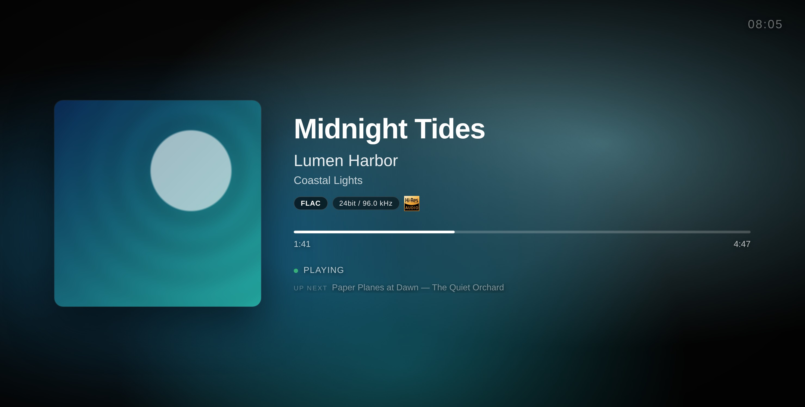

<p align="center">
  
</p>

# nowplaying

<p align="center">
  <a href="https://github.com/mat-d3v/nowplaying/actions/workflows/ci.yml"></a>
  <a href="https://github.com/mat-d3v/nowplaying/releases/latest"></a>
</p>

<p align="center">
  <a href="https://cdn.jsdelivr.net/gh/mat-d3v/nowplaying@main/assets/nowplaying-presentation.mp4">
    
  </a>
  <br>
  <sub>▶ <a href="https://cdn.jsdelivr.net/gh/mat-d3v/nowplaying@main/assets/nowplaying-presentation.mp4">Watch the presentation video</a> (52 s, with sound)</sub>
</p>



Fullscreen Now Playing page for MPD. Shows the current track with a dynamic background gradient pulled from the album art, audio quality badges, and Hi-Res detection.

No nginx and no Python packages required - the bridge only uses the standard library and serves everything on port 8766.

## What it looks like

- Background gradient extracted from the album art colors (or the blurred artwork, see [display options](#display-options))
- Album art straight from mpd (embedded tags or cover file in the folder). When mpd has none, and for radios, from the iTunes Search API (free, no key), or Last.fm with an API key. The title shows at once, the artwork follows
- Codec badge (FLAC, ALAC, MP3, AAC...) with bit depth and sample rate, also for tracks played from a UPnP/DLNA server (upmpdcli, BubbleUPnP, MinimServer...)
- Hi-Res Audio logo for lossless files >= 88.2 kHz or >= 24 bit, and for DSD
- VU meters, as an option: two needles that move with what mpd plays, with a peak lamp
- Radios: "Live" badge, "Artist - Title" split in two lines, station name below
- Untagged files show their file name
- AirPlay: what's played from an iPhone, iPad or Mac through shairport-sync shows up too
- Spotify Connect: what's played from the Spotify app through raspotify (librespot) shows up too
- Instant updates: the bridge pushes every change as it happens (track, pause, seek, queue)
- Progress bar, elapsed and total time, smoothly interpolated
- Scrolling marquee for long titles
- Dimmed overlay when paused
- Clock in the top right corner
- "Up next" line showing the next track in the queue
- Clear messages when mpd is unreachable or needs a password, and an offline indicator when the bridge stops responding
- English and French, following the browser's language
- A settings page for your phone: language, clock, background, size, VU meters... with a preview; saved, every screen shows them at once
- Fits any screen, from 800×480 to 4K: small screens shrink the layout so the text keeps its room, big ones grow it
- Upright screens (a TV on its side, the Raspberry Pi Touch Display 2, phones): artwork on top, text below
- Full-screen app from the home screen (on Android, this needs HTTPS or localhost), with Screen Wake Lock to keep the screen on (HTTPS or localhost too, see [below](#https-keeping-the-screen-on-and-installing-the-app))

## Requirements

- MPD
- Python 3.7 or later, nothing else to install
- Optional: a Last.fm API key - free at https://www.last.fm/api

## Getting started

```bash
git clone https://github.com/mat-d3v/nowplaying.git
cd nowplaying
cp .env.example .env   # optional: settings, e.g. your mpd password
python3 mpd-bridge.py
```

Then open http://localhost:8766 in a browser, or `http://<machine-ip>:8766` from a phone or tablet.

The page follows the browser's language (English or French). To force one: http://localhost:8766/?lang=fr or `?lang=en` (http://localhost:8766/index.fr.html still works too).

## Try it without mpd

```bash
DEMO=1 python3 mpd-bridge.py
```

Plays a few made-up tracks in a loop (Hi-Res FLAC, ALAC, MP3, a radio, DSD), one every 20 seconds (`DEMO_STEP` changes that), with generated artwork: handy to try the page, or to take screenshots like the one above.

## Check your setup

```bash
python3 mpd-bridge.py --check
```

Tests the connection to mpd and its password, the current track's format and artwork, instant updates, HTTPS, the port and online artwork, and says how to fix what's wrong. With Docker: `docker compose run --rm nowplaying python mpd-bridge.py --check`.

## Display options

From a phone or a computer, the settings page sets them for every screen, with a preview: http://localhost:8766/settings (or `http://<machine-ip>:8766/settings`). Saved, they show on the screens at once.

A screen can also have its own, in its address, combined with `&` - for example http://localhost:8766/?bg=blur&clock=12. They win over the saved settings.

| Option | Effect |
|--------|--------|
| `lang=fr`, `lang=en` | Force the language |
| `clock=0` | Hide the clock |
| `clock=12` | 12-hour clock |
| `next=0` | Hide the "Up next" line |
| `bg=blur` | Blurred artwork as the background, instead of the color gradient |
| `scale=1.5` | Size set by hand (from `0.5` to `3`), e.g. bigger for a screen seen from afar. By default, the page fits itself to the screen |
| `vu=1` | Two VU meters under the badges, moving with what mpd plays (needs a "fifo" output in `mpd.conf`, see [VU meters](#vu-meters)) |
| `shift=0` | No burn-in protection. By default, what's on screen drifts by a few pixels every 3 minutes, too slowly to notice, so OLED screens don't keep a ghost of it |

## Configuration

Settings come from environment variables or from a `.env` file next to `mpd-bridge.py` (copy `.env.example`). Environment variables take precedence over `.env`.

| Variable | Default | Description |
|----------|---------|-------------|
| MPD_HOST | 127.0.0.1 | MPD host |
| MPD_PORT | 6600 | MPD port |
| MPD_PASSWORD | empty | MPD password, if `mpd.conf` sets one |
| PORT | 8766 | Port of the bridge |
| ITUNES_ARTWORK | 1 (on) | Artwork from the iTunes Search API, for radios and tracks mpd has no artwork for. Only the artist, title and album are sent; `0` turns it off |
| LASTFM_API_KEY | empty (off) | Last.fm artwork fallback when mpd has none (needs artist and album tags) |
| TLS_CERT, TLS_KEY | empty | Certificate and private key (PEM) to serve HTTPS, see [below](#https-keeping-the-screen-on-and-installing-the-app) |
| ALSA_CARD | 0 | ALSA card read for the audio format when mpd doesn't report it |
| SHAIRPORT_PIPE | /tmp/shairport-sync-metadata | shairport-sync's metadata pipe, for AirPlay; empty turns AirPlay off |
| MPD_FIFO | /tmp/mpd.fifo | mpd's fifo output, read for the VU meters; empty turns them off |
| SPOTIFY | 1 (on) | Spotify Connect: what librespot (raspotify) plays, from its events; `0` turns it off |
| DATA_DIR | this folder | Where the bridge saves the display settings (`settings.json`) |
| SETTINGS_PAGE | 1 (on) | The settings page; `0` turns it off (saved settings still apply) |
| DEMO | empty | `1` for the demo mode: made-up tracks, no mpd needed |

## Run it as a service (systemd)

```bash
./install.sh
```

Creates `.env` (asks for an optional mpd password and Last.fm API key), installs an `mpd-bridge` service that runs as your user and starts at boot, then checks the setup. Run it again after a `git pull` to restart the service on the new version. Logs: `journalctl -u mpd-bridge -f`.

## Docker

```bash
docker compose up -d
```

The container uses the host network: the bridge reaches mpd on `127.0.0.1` and listens on the host's port 8766. Settings come from `.env`, as with a local install; the display settings saved from the settings page go to a volume of their own. Host networking works out of the box on Linux; Docker Desktop (macOS, Windows) needs it enabled in its settings. Logs: `docker compose logs -f`.

## AirPlay (shairport-sync)

When [shairport-sync](https://github.com/mikebrady/shairport-sync) runs on the same machine, the page also shows what's played over AirPlay: title, artist, album, artwork, progress, and the device sending it. AirPlay comes first while it plays; when it's paused and mpd plays, mpd shows; when AirPlay stops, mpd comes back.

In `/etc/shairport-sync.conf`, turn on the metadata (uncomment these lines in its `metadata` section), then restart it with `sudo systemctl restart shairport-sync`:

```
metadata =
{
	enabled = "yes";
	include_cover_art = "yes";
	pipe_name = "/tmp/shairport-sync-metadata";
	pipe_timeout = 5000;
};
```

The bridge reads that pipe by itself, and `--check` says whether it finds it. `SHAIRPORT_PIPE` sets another path, or turns AirPlay off when empty. Only one program can read the pipe. With Docker, uncomment its line in `docker-compose.yml`.

## Spotify Connect (raspotify)

With [raspotify](https://github.com/dtcooper/raspotify) on the same machine, it shows up as a speaker in the Spotify app, and the page shows what it plays: title, artist, album, artwork, progress, and the device in control. Like AirPlay, Spotify comes first while it plays; when AirPlay and Spotify both play, the last one started shows.

librespot, which raspotify runs, starts a program on each event (track changed, play, pause...): `spotify-event.py` passes them on to the bridge. Install it outside your home folder, where raspotify's service can run it, set it in raspotify's settings, and restart raspotify:

```bash
sudo install -m 755 spotify-event.py /usr/local/bin/nowplaying-spotify-event
echo 'LIBRESPOT_ONEVENT=/usr/local/bin/nowplaying-spotify-event' | sudo tee -a /etc/raspotify/conf
sudo systemctl restart raspotify
```

When the bridge uses another port, or HTTPS, add its address after the program: `LIBRESPOT_ONEVENT="/usr/local/bin/nowplaying-spotify-event https://127.0.0.1:8766"`. The bridge only takes these events from its own machine; `--check` says whether raspotify runs the program, and `SPOTIFY=0` turns Spotify off. Track details need librespot 0.5 or later; librespot started another way takes the same program as `--onevent`.

## VU meters

With `?vu=1`, two VU meters move with the music, like on a hi-fi amplifier: the needles follow the average level of each channel, and a lamp lights up when the sound gets close to full scale. They need a copy of what mpd plays: add this output to `/etc/mpd.conf`, then restart mpd with `sudo systemctl restart mpd`:

```
audio_output {
	type	"fifo"
	name	"nowplaying"
	path	"/tmp/mpd.fifo"
	format	"44100:16:2"
}
```

mpd keeps playing on your other outputs as before; this one only hands the bridge the sound, which it reads while a page shows the meters (nobody reading it costs nothing). `--check` says whether it finds the pipe, and `MPD_FIFO` sets another path. AirPlay and Spotify don't go through mpd: the meters hide while they play. With Docker, uncomment the pipe's line in `docker-compose.yml`. The demo mode has made-up levels: try http://localhost:8766/?vu=1.

## HTTPS: keeping the screen on and installing the app

Browsers only grant the Screen Wake Lock to secure pages: HTTPS, or `localhost` (and Android only installs a secure page as an app). A phone or tablet opening `http://192.168.x.x:8766` gets the page, but its screen may go to sleep. Two ways to get HTTPS:

**mkcert** makes a certificate for your local network. On the machine running the bridge, from the `nowplaying` folder (use its own name and IP address):

```bash
mkcert -install
mkcert -cert-file nowplaying.pem -key-file nowplaying-key.pem nowplaying.local 192.168.1.10
```

Then add to `.env` and restart the bridge, which now answers on https://192.168.1.10:8766 (`.pem` files are git-ignored):

```
TLS_CERT=nowplaying.pem
TLS_KEY=nowplaying-key.pem
```

Each phone or tablet must trust mkcert's root certificate, `rootCA.pem` in the folder shown by `mkcert -CAROOT`. On iOS, send it to the device (AirDrop, email), install the profile in Settings, then turn it on in Settings > General > About > Certificate Trust Settings. On Android: Settings > Security > Encryption & credentials > Install a certificate > CA certificate (menu names vary by brand).

**Tailscale**, if your devices are on your tailnet: `tailscale serve --bg 8766` publishes the bridge at `https://<machine>.<tailnet>.ts.net`, with a certificate every browser already trusts (HTTPS certificates must be enabled in the Tailscale admin console).

Already running nginx with certificates? `nginx.conf` is a reverse proxy example.

Once on HTTPS, Android offers to install the page ("Install app"); on iOS, Share > Add to Home Screen works either way. It then opens full screen, from its own icon.

## Raspberry Pi kiosk

On Raspberry Pi OS with desktop:

1. Install the bridge as a service: `./install.sh`
2. Turn off screen blanking: `sudo raspi-config` > Display Options > Screen Blanking > No
3. Start Chromium full screen when the desktop starts:

   ```bash
   mkdir -p ~/.config/autostart
   cat > ~/.config/autostart/nowplaying.desktop <<'DESKTOP'
   [Desktop Entry]
   Type=Application
   Name=Now Playing
   Exec=chromium --kiosk --noerrdialogs --disable-infobars --no-first-run --incognito http://localhost:8766
   DESKTOP
   ```

   (on older releases, the command is `chromium-browser`)
4. Rotate the screen if needed: Preferences > Screen Configuration. Upright, the page shows the artwork on top and the text below

The page comes from `localhost` there, so the Wake Lock works without HTTPS.

## Tests

```bash
python3 -m unittest discover -s tests -v    # the bridge, against a fake mpd
npm install --no-save playwright && npx playwright install chromium
node tests/ui_test.js                       # the page, in Chromium
```

GitHub Actions runs both on every push, with `shellcheck` on `install.sh`.

## License

[MIT](LICENSE)
